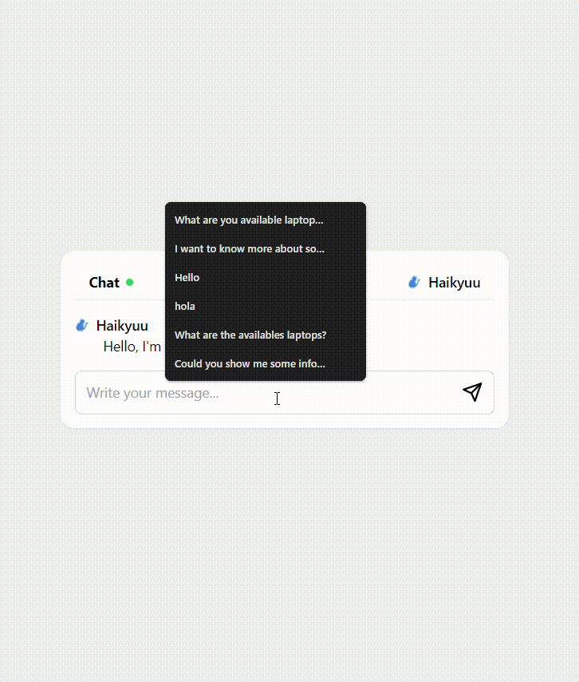

# Demo Chatbot

## Description

This chat window work as a main component to chat bot-user. In the main template, it displays a URL fetch
based on the [demo chatbot for makers](https://github.com/elmerescandon/makers-tech-chatbot).

## Table of Contents

-   [Installation](#installation)
-   [Usage](#usage)
-   [Contributing](#contributing)
-   [License](#license)

## Installation

Instructions on how to install and set up your project.

1. Install Astro globally:

    ```
    npm install -g astro
    ```

2. Create a new Astro project:

    ```
    astro create my-project
    ```

3. Navigate to the project directory:

    ```
    cd my-project
    ```

4. Install the dependencies:

    ```
    npm install
    ```

5. Start the development server:

    ```
    npm run dev
    ```

6. Open your browser and visit `http://localhost:4321` to view the application.

Note: Make sure you have Node.js and npm installed on your machine before proceeding with the installation.

## Demo

Here is a GIF demonstrating the chatbot:



## Contact

Please do not hesitate to contact us at [elmer.escandontufino@gmail.com](mailto:elmer.escandontufino@gmail.com)
